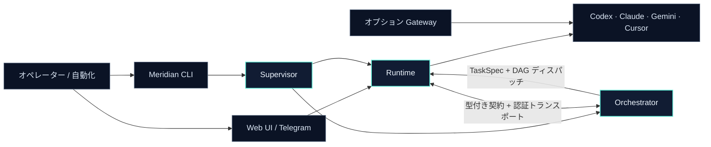

<p align="center">
  <a href="README.md">English</a>
  · <a href="README.zh-CN.md">简体中文</a>
  · <strong>日本語</strong>
</p>

<p align="center">
  
</p>

<p align="center">
  <strong>継続的で観測可能なコーディングエージェント運用のための、ローカルファーストなコントロールプレーン。</strong>
</p>

<p align="center">
  Codex、Claude、Gemini、Cursor を管理対象 Worker として実行し、TaskSpec DAG で連携させます。<br />
  CLI、ブラウザー UI、Telegram ブリッジ、認証 API から一貫して操作できます。
</p>

<p align="center">
  <a href="https://github.com/yzsnstotz/Meridian/actions/workflows/ci.yml"></a>
  
  
  <a href="LICENSE"></a>
</p>

<p align="center">
  <a href="#クイックスタート">クイックスタート</a>
  · <a href="docs/getting-started.md">セットアップガイド</a>
  · <a href="CLI.md">CLI リファレンス</a>
  · <a href="docs/system/SYSTEM_INDEX.md">アーキテクチャ</a>
  · <a href="CONTRIBUTING.md">コントリビューション</a>
</p>

---

## Meridian を選ぶ理由

コーディング CLI は優れた Worker ですが、複数のターミナルを同時に開くだけでは
本格的なマルチエージェントシステムにはなりません。Meridian は所有権、ルーティング、
永続状態、ヘルスチェック、依存関係を考慮したディスパッチ、一貫した操作面を提供します。

| 機能                                         | Meridian が提供するもの                                                                               |
| -------------------------------------------- | ----------------------------------------------------------------------------------------------------- |
| **マルチエージェント・オーケストレーション** | 明示または推論された TaskSpec DAG、依存関係対応ディスパッチ、再試行、検証、再起動からの復旧。         |
| **管理された Agent Runtime**                 | 永続的な Thread ID、Provider/モデルのルーティング、承認、キャンセル、ログ、会話履歴。                 |
| **統一された製品ライフサイクル**             | Supervisor が Runtime と Orchestrator を個別に起動し、実際の Ready 状態を待ち、回数制限付きで再起動。 |
| **ローカルファーストのセキュリティ**         | Provider の認証情報と永続状態をオペレーターの端末に保持し、Runtime HTTP と IPC の呼び出し元を認証。   |
| **複数の操作面**                             | JSON-first CLI、ブラウザー UI、Telegram アダプター、WebSocket/SSE ストリーム、認証 HTTP API。         |
| **互換モデル Gateway**                       | ローカルで認証済みの Provider CLI を利用する、オプションの OpenAI/Anthropic 互換エンドポイント。      |

## アーキテクチャ

Meridian は単一の製品でありながら、実行時の責務を分離しています。Gateway は同じ
Workspace でビルドされますが、オプションの独立サービスとして維持されます。



### 製品インターフェース

Meridian は日常的な Agent 操作と上位のオーケストレーションを分離しながら、
両者を直接行き来できる導線を備えています。

| Runtime Console                                                                                                                       | Orchestrator Dashboard                                                                                                                            |
| ------------------------------------------------------------------------------------------------------------------------------------- | ------------------------------------------------------------------------------------------------------------------------------------------------- |
| [](docs/assets/runtime-console.jpg) | [](docs/assets/orchestrator-dashboard.jpg) |
| Provider Session の起動と確認、認証情報とモデルの選択、ログ監視を行います。                                                           | ディスパッチポリシー、並列実行、検証、PM 解決、Roles、Schedulers を設定します。                                                                   |

### Workspace パッケージ

| パッケージ                                         | 責務                                                                                      |
| -------------------------------------------------- | ----------------------------------------------------------------------------------------- |
| [`@meridian/contracts`](packages/contracts/)       | 依存の少ない Schema、移植可能なパス、サービス契約。                                       |
| [`@meridian/runtime`](packages/runtime/)           | Hub、Provider ライフサイクル、Channels、認証 Web API、監視、ブラウザー UI。               |
| [`@meridian/orchestrator`](packages/orchestrator/) | Roles、TaskSpec ディスパッチ、Scheduler、検証、復旧、オーケストレーション GUI。           |
| [`@meridian/supervisor`](packages/supervisor/)     | Runtime/Orchestrator のネイティブなライフサイクル、Ready 確認、登録、回数制限付き再起動。 |
| [`@meridian/cli`](packages/cli/)                   | オペレーターと自動化向けの JSON-first インターフェース。                                  |
| [`@meridian/gateway`](packages/gateway/)           | ローカルの認証済み CLI を利用する、オプションの OpenAI/Anthropic 互換入口。               |

> **Hub や Roles の別リポジトリをチェックアウトする必要はありません。**
> 旧 Hub の機能は `@meridian/runtime` に、Roles は
> `@meridian/orchestrator` に統合済みです。現在も残る `meridian-roles`
> などの旧名称は、既存 UI のラベルまたは互換境界を示すものであり、別途
> インストールが必要という意味ではありません。

## クイックスタート

### 前提条件

- macOS または Linux
- Node.js **22.13 以降**と npm
- 対応する Provider CLI のうち、少なくとも 1 つをインストールしてログイン済みであること

### インストール

```bash
git clone https://github.com/yzsnstotz/Meridian.git
cd Meridian

npm ci
npm run build
npm link --workspace @meridian/cli
```

Meridian はオペレーター専用のプラットフォーム設定ディレクトリから設定を読み込みます。
開発環境では、明示的な設定ディレクトリを用意すると確認しやすくなります。

```bash
export MERIDIAN_CONFIG_DIR="$HOME/.config/meridian"
mkdir -p "$MERIDIAN_CONFIG_DIR"
cp .env.example "$MERIDIAN_CONFIG_DIR/.env"
```

必須の Telegram/オペレーター項目を 2 つ編集してください。ローカル Web/CLI の評価だけなら
形式が正しいプレースホルダーを利用できます。Telegram Interface を起動する前に、
BotFather の実際の認証情報へ置き換えてください。

### 起動と確認

```bash
meridian start
meridian doctor
meridian service list
```

Supervisor は管理対象サービスを起動し、初回起動時に非公開の Bootstrap/Web Token を
生成します。次のループバック専用 URL は、`meridian start` がサービスの準備完了を
報告した後に利用できます。

- Runtime Web UI/API：`http://127.0.0.1:3000/?token=<WEB_GUI_TOKEN>`
- Orchestrator UI/API：`http://127.0.0.1:7701`

`WEB_GUI_TOKEN` は非公開設定の `.env` から読み取ります。実際の Token をドキュメント、
Issue、Commit に貼り付けないでください。

最初の Codex Worker を起動します。

```bash
meridian spawn codex --workdir "$PWD" --mode bridge
meridian status --agents
meridian send <thread-id> "このリポジトリを調査し、アーキテクチャを要約してください。"
```

`spawn` の結果（または `meridian status --agents`）から `<thread-id>` をコピーします。

Provider のログイン、設定場所、最初のディスパッチ例、トラブルシューティングについては
[完全なセットアップガイド](docs/getting-started.md)を参照してください。

## オーケストレーションの仕組み

Orchestrator は明示的なタスクグラフを受け取るか、TaskSpec からグラフを推論します。
依存条件を満たしたタスクを Runtime Worker に割り当て、Socket Reply Channel で結果を
関連付け、再起動後に安全に復旧できるだけの状態を永続化します。

```text
TaskSpec
  └─ Orchestrator が DAG を構築 / 読み込み
       ├─ Worker A：アーキテクチャを調査
       ├─ Worker B：変更を実装             （A の後）
       └─ Validator：受け入れ条件を検証     （B の後）
            └─ Runtime が Provider、モデル、認証情報、Workspace を選択
```

ローカルの Orchestrator API から、明示的な 2 ステップ Dispatcher を作成します。

```bash
curl -X POST http://127.0.0.1:7701/api/role \
  -H 'Content-Type: application/json' \
  -d '{
    "thread_id": "dispatcher-demo",
    "role_type": "dispatcher",
    "tasks": [
      { "task_id": "A", "instruction": "リポジトリ構成を調査する", "depends_on": [] },
      { "task_id": "B", "instruction": "簡潔なアーキテクチャ概要を書く", "depends_on": ["A"] }
    ]
  }'
```

Orchestrator UI（`http://127.0.0.1:7701`）では、タスク状態、Prompt/設定エディター、
復旧操作、実行エビデンスをリアルタイムで確認できます。

## 操作インターフェース

| インターフェース        | 主な用途                             | 入口                                           |
| ----------------------- | ------------------------------------ | ---------------------------------------------- |
| **CLI**                 | ローカル操作とスクリプト             | [`CLI.md`](CLI.md)                             |
| **Runtime Web UI/API**  | Threads、認証情報、モデル検出、ログ  | `http://127.0.0.1:3000/?token=<WEB_GUI_TOKEN>` |
| **Orchestrator UI/API** | Roles、DAG、Prompts、復旧            | `http://127.0.0.1:7701`                        |
| **Telegram**            | リモート操作と進捗通知               | [運用ガイド](docs/operations.md#telegram)      |
| **Gateway**             | 既存の OpenAI/Anthropic クライアント | [Gateway ガイド](docs/gateway.md)              |
| **Unix Socket/A2A**     | 強力なローカルサービス統合           | [`MANUAL.md`](MANUAL.md)                       |

## オプションのモデル Gateway

Gateway は `/v1/chat/completions`、`/v1/models`、Anthropic 形式の `/v1/messages`
を提供し、ローカルの Codex、Claude、Gemini、Antigravity Session に接続します。
Meridian Supervisor の管理対象には含まれません。

```bash
npm run start:gateway
```

デフォルトでは `127.0.0.1:8789` にバインドし、
`~/.meridian-gateway/gateway-key` に非公開 API Key を生成します。Loopback の外へ
公開する前に、[Gateway ガイド](docs/gateway.md)を確認してください。

## ドキュメント

| ドキュメント                                      | 利用する場面                                                |
| ------------------------------------------------- | ----------------------------------------------------------- |
| [Getting started](docs/getting-started.md)        | インストール、設定、起動、最初の Worker/DAG の実行。        |
| [CLI リファレンス](CLI.md)                        | ライフサイクル、Agent、認証情報、サービスコマンドの自動化。 |
| [統合マニュアル](MANUAL.md)                       | HTTP、WebSocket、認証済み Hub IPC からの統合。              |
| [運用ガイド](docs/operations.md)                  | ライフサイクル、Telegram、パス、ポート、ログ、安全な復旧。  |
| [Gateway ガイド](docs/gateway.md)                 | OpenAI/Anthropic 互換のローカルエンドポイントの利用。       |
| [システム索引](docs/system/SYSTEM_INDEX.md)       | パッケージ所有権、境界、モジュール別ドキュメントの確認。    |
| [Roles 移行](docs/migration/roles-to-meridian.md) | 単独の Meridian-Roles インストールからの状態移行。          |
| [コントリビューション](CONTRIBUTING.md)           | 目的を絞った変更と適切な検証。                              |
| [セキュリティポリシー](SECURITY.md)               | 脆弱性の非公開報告とデプロイ境界の確認。                    |

## セキュリティモデル

- Runtime Web/API と Gateway Completion の通信は Token で認証されます。
- IPC の呼び出し元は、非公開 Bootstrap Key から派生した登録済み ID を使用します。
- Credential Record は Owner ごとに分離され、非公開ディレクトリに保存されます。
- Provider CLI は明示的な Workspace と承認設定を用いてローカルで実行されます。
- Runtime の状態、ログ、Socket、サービス記述子は、既定でユーザー別のプラットフォームディレクトリに解決されます。

Orchestrator UI/API はローカルの Loopback 境界を前提に設計されています。TLS、ネットワーク
制限、独立したアクセス制御を前段に設けない限り、すべてのサービスを Loopback に維持して
ください。生成された `.env`、状態、認証情報、Gateway Key をコミットしないでください。

## 開発

```bash
npm ci
npm run typecheck
npm run build
npm test
npm run test:orchestrator
```

パッケージ境界は `npm run test:boundaries` で検証されます。テストマトリクスと
Pull Request の要件については [`CONTRIBUTING.md`](CONTRIBUTING.md)を参照してください。

## プロジェクトの状態

Meridian は活発に開発中です。インターフェースは明示的に定義され、テストされていますが、
無人運用や外部公開されたワークロードで利用する前に、オペレーターが変更内容を確認してください。

本プロジェクトは [MIT License](LICENSE) の下で公開されています。
