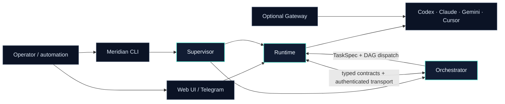

<p align="center">
  <strong>English</strong>
  · <a href="README.zh-CN.md">简体中文</a>
  · <a href="README.ja.md">日本語</a>
</p>

<p align="center">
  
</p>

<p align="center">
  <strong>A local-first control plane for durable, observable coding-agent work.</strong>
</p>

<p align="center">
  Run Codex, Claude, Gemini, and Cursor as managed workers. Coordinate TaskSpec DAGs.<br />
  Operate everything through one CLI, browser UI, Telegram bridge, or authenticated API.
</p>

<p align="center">
  <a href="https://github.com/yzsnstotz/Meridian/actions/workflows/ci.yml"></a>
  
  
  <a href="LICENSE"></a>
</p>

<p align="center">
  <a href="#quick-start">Quick start</a>
  · <a href="docs/getting-started.md">Setup guide</a>
  · <a href="CLI.md">CLI reference</a>
  · <a href="docs/system/SYSTEM_INDEX.md">Architecture</a>
  · <a href="#community">Community</a>
  · <a href="CONTRIBUTING.md">Contributing</a>
</p>

---

## Community

<table>
  <tr>
    <td width="58%" valign="middle">
      <h3>Build Meridian together</h3>
      <p>
        Join <strong>Meridian Exchange Group 2</strong> on WeChat to compare
        workflows, share feedback, and meet other builders using Meridian.
      </p>
      <p>
        <strong>How to join:</strong> scan the QR code with WeChat. Click the
        image to open the full-resolution version if you are viewing this page
        on a phone.
      </p>
      <p>
        <sub>The invitation QR code is valid through <strong>August 21,
        2026</strong>. This image will be replaced when the invitation is
        refreshed.</sub>
      </p>
    </td>
    <td width="42%" align="center">
      <a href="docs/assets/wechat-community-group-2.jpg">
        
      </a><br />
      <sub>Meridian Exchange Group 2 · WeChat</sub>
    </td>
  </tr>
</table>

## Why Meridian

Coding CLIs are excellent workers, but a real multi-agent system needs more than
parallel terminals. Meridian provides the operational layer around them:
ownership, routing, durable state, health checks, dependency-aware dispatch,
and a consistent control surface.

| Capability                    | What Meridian provides                                                                                                 |
| ----------------------------- | ---------------------------------------------------------------------------------------------------------------------- |
| **Multi-agent orchestration** | Explicit or inferred TaskSpec DAGs, dependency-aware dispatch, retries, validation, and restart recovery.              |
| **Managed agent runtime**     | Persistent thread identities, provider/model routing, approvals, cancellation, logs, and conversation history.         |
| **One product lifecycle**     | A supervisor starts Runtime and Orchestrator independently, waits for real readiness, and applies bounded restarts.    |
| **Local-first security**      | Provider credentials and durable state stay on the operator's machine; Runtime HTTP and IPC callers are authenticated. |
| **Multiple control surfaces** | JSON-first CLI, browser interfaces, Telegram adapters, WebSocket/SSE streams, and an authenticated HTTP API.           |
| **Compatible model gateway**  | Optional OpenAI- and Anthropic-shaped endpoints backed by locally authenticated provider CLIs.                         |

## Architecture

Meridian is one product with separable runtime responsibilities. The Gateway is
built in the same workspace but intentionally remains an optional, independent
service.



### Product surfaces

Meridian keeps day-to-day agent control and higher-level orchestration
separate, while giving operators a direct path between them.

| Runtime Console                                                                                                                                  | Orchestrator Dashboard                                                                                                                                 |
| ------------------------------------------------------------------------------------------------------------------------------------------------ | ------------------------------------------------------------------------------------------------------------------------------------------------------ |
| [](docs/assets/runtime-console.jpg) | [](docs/assets/orchestrator-dashboard.jpg) |
| Launch and inspect provider sessions, choose credentials and models, and monitor logs.                                                           | Configure dispatch policy, parallel execution, validation, PM resolution, roles, and schedulers.                                                       |

### Workspace packages

| Package                                            | Responsibility                                                                        |
| -------------------------------------------------- | ------------------------------------------------------------------------------------- |
| [`@meridian/contracts`](packages/contracts/)       | Dependency-light schemas, portable paths, and service contracts.                      |
| [`@meridian/runtime`](packages/runtime/)           | Hub, provider lifecycle, channels, authenticated Web API, monitoring, and browser UI. |
| [`@meridian/orchestrator`](packages/orchestrator/) | Roles, TaskSpec dispatch, scheduler, validation, recovery, and orchestration GUI.     |
| [`@meridian/supervisor`](packages/supervisor/)     | Native Runtime/Orchestrator lifecycle, readiness, registration, and bounded restart.  |
| [`@meridian/cli`](packages/cli/)                   | JSON-first operator and automation interface.                                         |
| [`@meridian/gateway`](packages/gateway/)           | Optional OpenAI/Anthropic-compatible ingress for locally authenticated CLIs.          |

> **No separate Hub or Roles checkout is required.** The former Hub capability
> lives in `@meridian/runtime`, and Roles lives in `@meridian/orchestrator`.
> Some existing UI labels and compatibility boundaries still use legacy names
> such as `meridian-roles`; they refer to these integrated components, not to a
> separate installation.

## Quick start

### Prerequisites

- macOS or Linux
- Node.js **22.13 or newer** and npm
- At least one supported provider CLI installed and authenticated

### Install

```bash
git clone https://github.com/yzsnstotz/Meridian.git
cd Meridian

npm ci
npm run build
npm link --workspace @meridian/cli
```

Meridian reads operator configuration from a private platform config directory.
For a predictable development setup:

```bash
export MERIDIAN_CONFIG_DIR="$HOME/.config/meridian"
mkdir -p "$MERIDIAN_CONFIG_DIR"
cp .env.example "$MERIDIAN_CONFIG_DIR/.env"
```

Edit the two required Telegram/operator values in that file. Placeholder values
are sufficient for a local Web/CLI evaluation; use real BotFather credentials
before starting the Telegram interface.

### Start and verify

```bash
meridian start
meridian doctor
meridian service list
```

The supervisor starts the managed services and generates private bootstrap/Web
tokens on first launch. These loopback-only addresses are available after
`meridian start` reports the services ready:

- Runtime Web UI and API: `http://127.0.0.1:3000/?token=<WEB_GUI_TOKEN>`
- Orchestrator UI and API: `http://127.0.0.1:7701`

Read `WEB_GUI_TOKEN` from the private config `.env`; do not paste a real token
into documentation, issues, or commits.

Launch a first Codex worker:

```bash
meridian spawn codex --workdir "$PWD" --mode bridge
meridian status --agents
meridian send <thread-id> "Inspect this repository and summarize its architecture."
```

Copy `<thread-id>` from the `spawn` result (or `meridian status --agents`).

See the [complete setup guide](docs/getting-started.md) for provider login,
configuration locations, first-dispatch examples, and troubleshooting.

## How orchestration works

The Orchestrator accepts an explicit task graph or infers one from a TaskSpec.
It dispatches eligible tasks to Runtime workers, correlates results over the
socket reply channel, and persists enough state to recover safely after a
restart.

```text
TaskSpec
  └─ Orchestrator builds / loads a DAG
       ├─ Worker A: inspect architecture
       ├─ Worker B: implement change       (after A)
       └─ Validator: verify acceptance     (after B)
            └─ Runtime selects provider, model, credentials, and workspace
```

Create a small explicit dispatcher through the local Orchestrator API:

```bash
curl -X POST http://127.0.0.1:7701/api/role \
  -H 'Content-Type: application/json' \
  -d '{
    "thread_id": "dispatcher-demo",
    "role_type": "dispatcher",
    "tasks": [
      { "task_id": "A", "instruction": "Inspect the repository", "depends_on": [] },
      { "task_id": "B", "instruction": "Write a concise architecture summary", "depends_on": ["A"] }
    ]
  }'
```

The Orchestrator UI exposes live task state, prompt/config editors, recovery
controls, and execution evidence at `http://127.0.0.1:7701`.

## Operating surfaces

| Surface                 | Best for                                    | Entry point                                     |
| ----------------------- | ------------------------------------------- | ----------------------------------------------- |
| **CLI**                 | Local operation and scripts                 | [`CLI.md`](CLI.md)                              |
| **Runtime Web UI/API**  | Threads, credentials, model discovery, logs | `http://127.0.0.1:3000/?token=<WEB_GUI_TOKEN>`  |
| **Orchestrator UI/API** | Roles, DAGs, prompts, recovery              | `http://127.0.0.1:7701`                         |
| **Telegram**            | Remote control and progress updates         | [Operations guide](docs/operations.md#telegram) |
| **Gateway**             | Existing OpenAI/Anthropic clients           | [Gateway guide](docs/gateway.md)                |
| **Unix socket/A2A**     | Strong local service integration            | [`MANUAL.md`](MANUAL.md)                        |

## Optional model gateway

The Gateway exposes `/v1/chat/completions`, `/v1/models`, and Anthropic-style
`/v1/messages` routes backed by local Codex, Claude, Gemini, or Antigravity
sessions. It is deliberately not managed by the Meridian supervisor.

```bash
npm run start:gateway
```

It binds to `127.0.0.1:8789` by default and generates a private API key at
`~/.meridian-gateway/gateway-key`. Read the [Gateway guide](docs/gateway.md)
before exposing it beyond loopback.

## Documentation

| Document                                               | Use it when you need to…                                        |
| ------------------------------------------------------ | --------------------------------------------------------------- |
| [Getting started](docs/getting-started.md)             | Install, configure, start, and run the first worker/DAG.        |
| [CLI reference](CLI.md)                                | Script lifecycle, agent, credential, and service commands.      |
| [Integration manual](MANUAL.md)                        | Integrate through HTTP, WebSocket, or authenticated Hub IPC.    |
| [Operations guide](docs/operations.md)                 | Run lifecycle, Telegram, paths, ports, logs, and safe recovery. |
| [Gateway guide](docs/gateway.md)                       | Use OpenAI/Anthropic-compatible local endpoints.                |
| [System index](docs/system/SYSTEM_INDEX.md)            | Find package ownership, boundaries, and module-level docs.      |
| [Roles migration](docs/migration/roles-to-meridian.md) | Move state from a standalone Meridian-Roles installation.       |
| [Contributing](CONTRIBUTING.md)                        | Make a focused change and run the right verification.           |
| [Security policy](SECURITY.md)                         | Report vulnerabilities privately and review deployment posture. |

## Security model

- Runtime Web/API and Gateway completion traffic is token-authenticated.
- IPC callers use registered identities derived from a private bootstrap key.
- Credential records are owner-scoped and stored under private directories.
- Provider CLIs run locally with explicit workspace and approval settings.
- Runtime state, logs, sockets, and service descriptors resolve to per-user
  platform directories unless the operator supplies explicit overrides.

The Orchestrator UI/API is designed for the local loopback boundary. Keep every
service on loopback unless you place it behind TLS and an access-controlled
reverse proxy. Never commit generated `.env`, state, credential, or gateway-key
files.

## Development

```bash
npm ci
npm run typecheck
npm run build
npm test
npm run test:orchestrator
```

Package boundaries are enforced by `npm run test:boundaries`. See
[`CONTRIBUTING.md`](CONTRIBUTING.md) for the full test matrix and pull-request
expectations.

## Project status

Meridian is under active development. Interfaces are intentionally explicit and
tested, but operators should review changes before using the system for
unattended or externally reachable workloads.

Licensed under the [MIT License](LICENSE).
