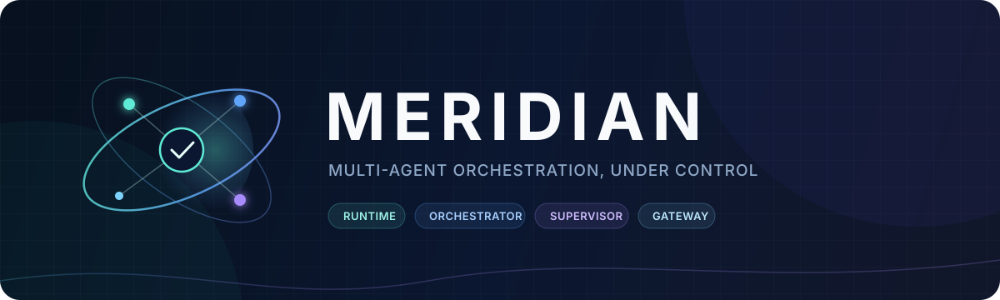
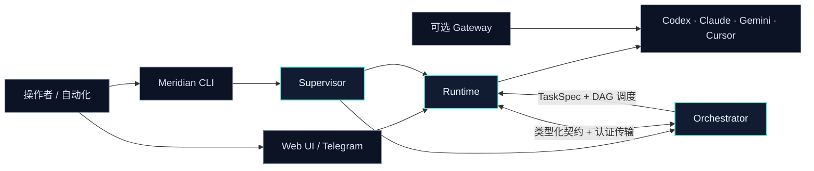
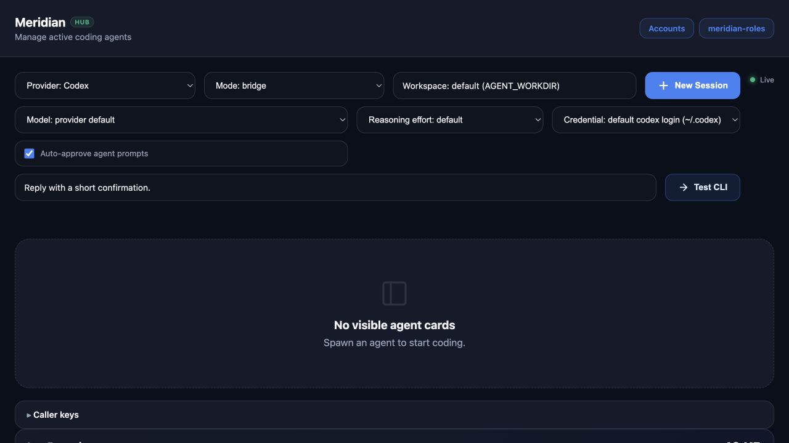
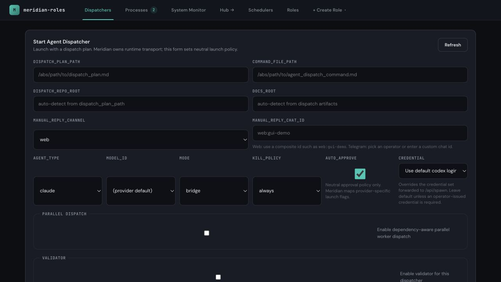

<p align="center">
  <a href="README.md">English</a>
  · <strong>简体中文</strong>
  · <a href="README.ja.md">日本語</a>
</p>

<p align="center">
  
</p>

<p align="center">
  <strong>一个为持久、可观察的编程 Agent 工作而生的本地优先控制平面。</strong>
</p>

<p align="center">
  将 Codex、Claude、Gemini 与 Cursor 作为受控 Worker 运行，并用 TaskSpec DAG 协调任务。<br />
  通过一套 CLI、浏览器界面、Telegram 桥接或认证 API 完成全部操作。
</p>

<p align="center">
  <a href="https://github.com/yzsnstotz/Meridian/actions/workflows/ci.yml"></a>
  
  
  <a href="LICENSE"></a>
</p>

<p align="center">
  <a href="#快速开始">快速开始</a>
  · <a href="docs/getting-started.md">安装指南</a>
  · <a href="CLI.md">CLI 参考</a>
  · <a href="docs/system/SYSTEM_INDEX.md">系统架构</a>
  · <a href="#交流群">交流群</a>
  · <a href="CONTRIBUTING.md">参与贡献</a>
</p>

---

## 为什么选择 Meridian

编程 CLI 是优秀的 Worker，但真正的多 Agent 系统不能只是同时打开多个终端。
Meridian 补齐了围绕 Agent 的运行层：所有权、路由、持久状态、健康检查、
依赖感知调度，以及一致的控制界面。

| 能力                   | Meridian 提供的内容                                                             |
| ---------------------- | ------------------------------------------------------------------------------- |
| **多 Agent 编排**      | 显式或自动推导的 TaskSpec DAG、依赖感知调度、重试、验证与重启恢复。             |
| **受控 Agent Runtime** | 持久线程标识、Provider/模型路由、审批、取消、日志与对话历史。                   |
| **统一产品生命周期**   | Supervisor 分别启动 Runtime 与 Orchestrator，等待真实就绪，并实施有限重启。     |
| **本地优先安全**       | Provider 凭据与持久状态保留在操作者机器上；Runtime HTTP 与 IPC 调用方需要认证。 |
| **多种控制界面**       | JSON-first CLI、浏览器界面、Telegram 适配器、WebSocket/SSE 流与认证 HTTP API。  |
| **兼容模型网关**       | 可选的 OpenAI/Anthropic 兼容端点，底层使用本机已登录的 Provider CLI。           |

## 架构

Meridian 是一个产品，但运行职责彼此分离。Gateway 与其他包在同一 Workspace
构建，同时保持为可选、独立的服务。



### 产品界面

Meridian 将日常 Agent 控制与更高层的任务编排分开，同时保留两者之间的直接入口。

| Runtime Console                                                                                                             | Orchestrator Dashboard                                                                                                           |
| --------------------------------------------------------------------------------------------------------------------------- | -------------------------------------------------------------------------------------------------------------------------------- |
| [](docs/assets/runtime-console.jpg) | [](docs/assets/orchestrator-dashboard.jpg) |
| 启动和检查 Provider Session，选择凭据与模型并监控日志。                                                                     | 配置调度策略、并行执行、验证、PM 处理、Roles 与 Schedulers。                                                                     |

### Workspace 包

| 包                                                 | 职责                                                               |
| -------------------------------------------------- | ------------------------------------------------------------------ |
| [`@meridian/contracts`](packages/contracts/)       | 低依赖 Schema、可移植路径与服务契约。                              |
| [`@meridian/runtime`](packages/runtime/)           | Hub、Provider 生命周期、Channels、认证 Web API、监控与浏览器界面。 |
| [`@meridian/orchestrator`](packages/orchestrator/) | Roles、TaskSpec 调度、Scheduler、验证、恢复与编排 GUI。            |
| [`@meridian/supervisor`](packages/supervisor/)     | Runtime/Orchestrator 原生生命周期、就绪检测、注册与有限重启。      |
| [`@meridian/cli`](packages/cli/)                   | 面向操作者与自动化的 JSON-first 接口。                             |
| [`@meridian/gateway`](packages/gateway/)           | 使用本机已认证 CLI 的可选 OpenAI/Anthropic 兼容入口。              |

> **不需要另外检出 Hub 或 Roles 仓库。** 原 Hub 能力已经进入
> `@meridian/runtime`，Roles 已经进入 `@meridian/orchestrator`。目前仍出现的
> `meridian-roles` 等旧名称属于现有界面标签或兼容边界，指向的仍是上述集成组件，
> 并不代表需要单独安装。

## 交流群

<table>
  <tr>
    <td width="58%" valign="middle">
      <h3>一起共建 Meridian</h3>
      <p>
        欢迎加入微信 <strong>Meridian 交流 2 群</strong>，交流使用方式、分享反馈，
        认识更多正在使用 Meridian 的开发者。
      </p>
      <p>
        <strong>加入方式：</strong>使用微信扫描二维码。如果你正在手机上浏览此页面，
        可以点击图片查看原图后识别二维码。
      </p>
      <p>
        <sub>该邀请二维码有效期至 <strong>2026 年 8 月 21 日</strong>；
        邀请更新后会及时替换此图片。</sub>
      </p>
    </td>
    <td width="42%" align="center">
      <a href="docs/assets/wechat-community-group-2.jpg">
        
      </a><br />
      <sub>Meridian 交流 2 群 · 微信</sub>
    </td>
  </tr>
</table>

## 快速开始

### 环境要求

- macOS 或 Linux
- Node.js **22.13 或更高版本**以及 npm
- 至少安装并登录一个受支持的 Provider CLI

### 安装

```bash
git clone https://github.com/yzsnstotz/Meridian.git
cd Meridian

npm ci
npm run build
npm link --workspace @meridian/cli
```

Meridian 从操作者私有的平台配置目录读取设置。开发环境可以使用一个明确目录：

```bash
export MERIDIAN_CONFIG_DIR="$HOME/.config/meridian"
mkdir -p "$MERIDIAN_CONFIG_DIR"
cp .env.example "$MERIDIAN_CONFIG_DIR/.env"
```

编辑其中两个必填的 Telegram/操作者字段。只体验本地 Web/CLI 时可以先使用
格式正确的占位值；启动 Telegram Interface 前必须换成真实 BotFather 凭据。

### 启动并检查

```bash
meridian start
meridian doctor
meridian service list
```

Supervisor 会启动受管服务，并在首次运行时生成私有的 Bootstrap/Web Token。
以下地址仅绑定本机回环网络，并在 `meridian start` 报告服务就绪后可用：

- Runtime Web UI/API：`http://127.0.0.1:3000/?token=<WEB_GUI_TOKEN>`
- Orchestrator UI/API：`http://127.0.0.1:7701`

请从私有配置 `.env` 中读取 `WEB_GUI_TOKEN`；不要把真实 Token 粘贴到文档、
Issue 或 Commit 中。

启动第一个 Codex Worker：

```bash
meridian spawn codex --workdir "$PWD" --mode bridge
meridian status --agents
meridian send <thread-id> "检查这个仓库并概括它的架构。"
```

请从 `spawn` 返回结果（或 `meridian status --agents`）中复制 `<thread-id>`。

Provider 登录、配置目录、首次调度示例与故障排查，请阅读
[完整安装指南](docs/getting-started.md)。

## 编排如何工作

Orchestrator 接收显式任务图，或从 TaskSpec 推导任务图。它把满足依赖条件的
任务派发给 Runtime Worker，通过 Socket Reply Channel 关联结果，并持久化足够的
状态，从而在重启后安全恢复。

```text
TaskSpec
  └─ Orchestrator 构建 / 加载 DAG
       ├─ Worker A：检查架构
       ├─ Worker B：实现变更          （等待 A）
       └─ Validator：验证验收标准     （等待 B）
            └─ Runtime 选择 Provider、模型、凭据与 Workspace
```

通过本地 Orchestrator API 创建一个显式的两步 Dispatcher：

```bash
curl -X POST http://127.0.0.1:7701/api/role \
  -H 'Content-Type: application/json' \
  -d '{
    "thread_id": "dispatcher-demo",
    "role_type": "dispatcher",
    "tasks": [
      { "task_id": "A", "instruction": "检查仓库结构", "depends_on": [] },
      { "task_id": "B", "instruction": "编写简洁的架构概述", "depends_on": ["A"] }
    ]
  }'
```

Orchestrator UI 会在 `http://127.0.0.1:7701` 展示实时任务状态、Prompt/配置编辑器、
恢复控制和执行证据。

## 操作界面

| 界面                    | 适合场景                      | 入口                                           |
| ----------------------- | ----------------------------- | ---------------------------------------------- |
| **CLI**                 | 本地操作与脚本                | [`CLI.md`](CLI.md)                             |
| **Runtime Web UI/API**  | Threads、凭据、模型发现与日志 | `http://127.0.0.1:3000/?token=<WEB_GUI_TOKEN>` |
| **Orchestrator UI/API** | Roles、DAG、Prompts 与恢复    | `http://127.0.0.1:7701`                        |
| **Telegram**            | 远程控制与进度更新            | [运维指南](docs/operations.md#telegram)        |
| **Gateway**             | 现有 OpenAI/Anthropic 客户端  | [Gateway 指南](docs/gateway.md)                |
| **Unix Socket/A2A**     | 强本地服务集成                | [`MANUAL.md`](MANUAL.md)                       |

## 可选模型网关

Gateway 提供 `/v1/chat/completions`、`/v1/models` 与 Anthropic 风格的
`/v1/messages` 路由，底层使用本机 Codex、Claude、Gemini 或 Antigravity Session。
它不会由 Meridian Supervisor 管理。

```bash
npm run start:gateway
```

默认绑定 `127.0.0.1:8789`，并在 `~/.meridian-gateway/gateway-key` 生成私有 API Key。
将其暴露到 Loopback 之外前，请先阅读 [Gateway 指南](docs/gateway.md)。

## 文档

| 文档                                              | 使用场景                                             |
| ------------------------------------------------- | ---------------------------------------------------- |
| [快速上手](docs/getting-started.md)               | 安装、配置、启动并运行第一个 Worker/DAG。            |
| [CLI 参考](CLI.md)                                | 编写生命周期、Agent、凭据与服务命令脚本。            |
| [集成手册](MANUAL.md)                             | 通过 HTTP、WebSocket 或认证 Hub IPC 集成。           |
| [运维指南](docs/operations.md)                    | 运行生命周期、Telegram、路径、端口、日志与安全恢复。 |
| [Gateway 指南](docs/gateway.md)                   | 使用 OpenAI/Anthropic 兼容的本地端点。               |
| [系统索引](docs/system/SYSTEM_INDEX.md)           | 查找包所有权、边界与模块级文档。                     |
| [Roles 迁移](docs/migration/roles-to-meridian.md) | 从独立 Meridian-Roles 安装迁移状态。                 |
| [参与贡献](CONTRIBUTING.md)                       | 提交聚焦的变更并完成正确验证。                       |
| [安全策略](SECURITY.md)                           | 私下报告漏洞并检查部署安全边界。                     |

## 安全模型

- Runtime Web/API 与 Gateway Completion 请求使用 Token 认证。
- IPC 调用方使用基于私有 Bootstrap Key 派生的注册身份。
- Credential Record 按 Owner 隔离，并存储在私有目录下。
- Provider CLI 在本地运行，使用明确的 Workspace 与审批设置。
- Runtime 状态、日志、Socket 与服务描述默认解析到每用户的平台目录。

Orchestrator UI/API 面向本地 Loopback 边界设计。除非前方已经部署 TLS、网络限制
和独立访问控制，否则请让所有服务保持在 Loopback。不要提交生成的 `.env`、状态、
凭据或 Gateway Key 文件。

## 开发

```bash
npm ci
npm run typecheck
npm run build
npm test
npm run test:orchestrator
```

`npm run test:boundaries` 会检查包边界。完整测试矩阵与 Pull Request 要求请参阅
[`CONTRIBUTING.md`](CONTRIBUTING.md)。

## 项目状态

Meridian 正在积极开发。接口保持显式并经过测试，但在用于无人值守或可从外部访问的
工作负载之前，操作者仍应审查相关变更。

本项目采用 [MIT License](LICENSE)。
