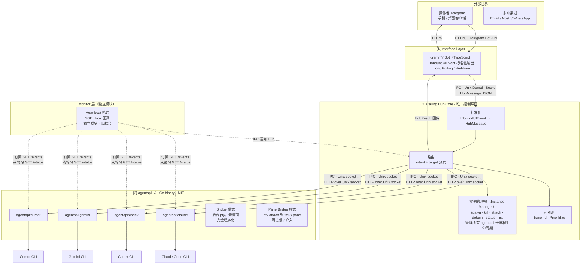

# Calling Hub · Phase 0 架构图（Mermaid 版）

> 由交互式 JSX 架构图转换而来。  
> 保留主要层级、节点、协议与关键关系；不保留原始点击详情、配色高亮与 hover 交互。

## 架构图

## 分层说明

### 外部世界
- 操作者通过 Telegram 客户端发送消息。
- 未来可扩展到 Email、Nostr、WhatsApp 等渠道。

### Interface Layer
- 使用 `grammY Bot` 作为 Telegram 渠道适配器。
- 职责是收发消息与标准化输入，不承担业务判断。
- 输出统一的 `InboundUIEvent`，再转入 Hub Core。

### Calling Hub Core
- 是唯一控制平面。
- 负责四件事：
  - 标准化：`InboundUIEvent → HubMessage`
  - 路由：按 `intent + target` 分发
  - 可观测：`trace_id + Pino`
  - 实例管理：管理全部 agentapi 子进程生命周期

### Monitor 层
- 独立于主流程。
- 优先通过 SSE 订阅 `GET /events`。
- 失联时可降级为 Heartbeat 轮询 `GET /status`。
- 发现状态变化或异常后，通过 IPC 通知 Hub。

### agentapi 层
- 使用 `github.com/coder/agentapi`。
- Hub 通过 Unix Domain Socket 以 HTTP over Unix socket 的方式访问：
  - `POST /message`
  - `GET /status`
  - `GET /events`

### CLI Agent 层
- 当前包含：
  - Claude Code CLI
  - Codex CLI
  - Gemini CLI
  - Cursor CLI
- 每个 CLI Agent 对应一个 agentapi 实例。

## 模式说明

| 模式 | 含义 |
|---|---|
| Bridge 模式 | agentapi 在后台 pty 运行，无可视终端，适合无人值守 |
| Pane Bridge 模式 | pty 挂到 tmux pane，操作者可以观察甚至介入 |

## 通信协议

### 内部通信
- Hub ↔ agentapi：Unix Domain Socket（如 `/tmp/agentapi-{id}.sock`）
- Hub ↔ Monitor：Unix Domain Socket（如 `/tmp/hub-monitor.sock`）
- Hub ↔ 实例管理器：同进程内部调用

### 外部通信
- 操作者 ↔ Telegram Bot API：HTTPS
- Telegram Bot API ↔ Hub：Webhook HTTPS 或 Long Polling
- 结果回传：Hub → Telegram Bot API → 操作者

## 保真说明
这份 Mermaid 版保留了原 JSX 架构图的：
- 分层结构
- 核心节点
- 关键连线
- 协议含义
- Bridge / Pane Bridge 双模式

未保留的部分：
- 点击节点弹出的详情面板
- 原始颜色主题
- hover / active 状态
- JSX 里的 UI 微交互
